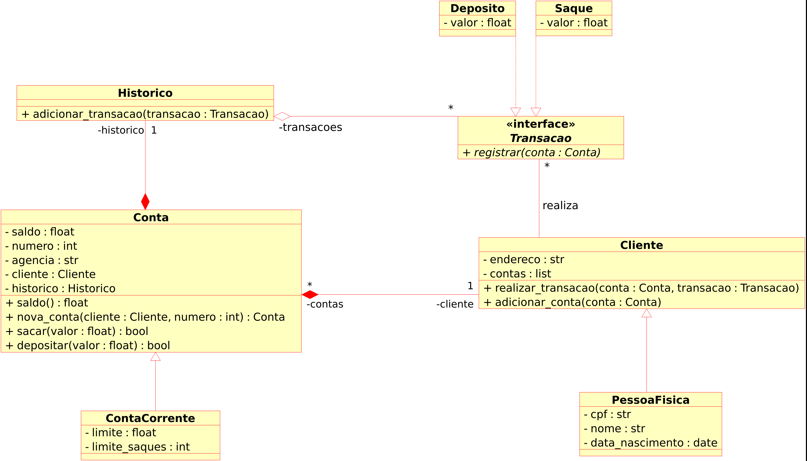

# Modelando o Sistema Bancário em POO com Python

O objetivo do projeto era desenvolver um código em Python com base em um diagrama de classes.

Não consegui fazer exatamente de acordo com o diagrama, então adaptei o projeto de forma que a aplicação funcionasse.

O arquivo original.py foi uma tentativa de desenvolver como estava do diagrama, porém não está funcinando. Já no arquivo adatado.py, foi realizado algumas alterações para simplificar o projeto.

### Funcionalidades:
 - Criação de várias contas para clientes
 - Criação de várias contas bancárias para cada cliente
 - Operação de depósito
 - Operação de saque
 - Consulta de saldo
 - Consulta do histórico de transações
 - Listagem de clientes
 - Listagem de contas bancárias

É possível escolher para qual cliente será criado a conta bancária informando o CPF. Para as operações de depósito, saque e consultas, é possível escolher a conta bancária que será utilizada informando o número da conta.

## Diagrama

